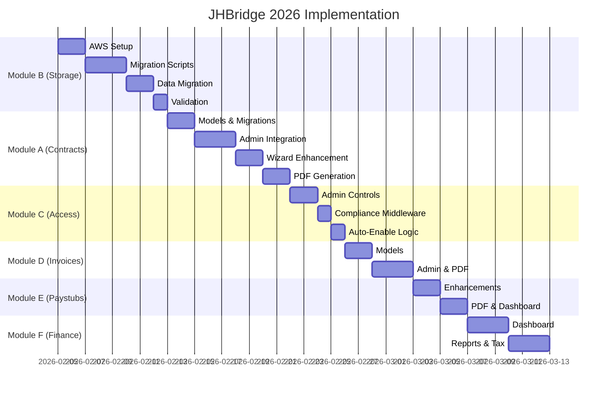

# JHBridge 2026 - Master Implementation Roadmap

> **Version**: 2.0 | **Date**: 3 Février 2026  
> **Scope**: Complete Platform Evolution

---

## Executive Summary

Ce document couvre l'implémentation complète de la plateforme JHBridge 2026:

| Module | Description | Priority |
|--------|-------------|----------|
| **A** | Contract Compliance 2026 | 🔴 Critical |
| **B** | Storage Migration (B2 → S3) | 🔴 Critical |
| **C** | Account Access Control | 🟠 High |
| **D** | Invoice Maker | 🟠 High |
| **E** | Paystub Management | 🟡 Medium |
| **F** | Finance & Accounting Dashboard | 🟡 Medium |

---

## User Review Required

> [!IMPORTANT]
> **Ordre d'implémentation recommandé**: B → A → C → D → E → F  
> Le storage doit être migré avant d'implémenter les nouvelles fonctionnalités de documents.

> [!WARNING]
> **Breaking Changes**: Le module C (Account Access Control) modifie le comportement d'accès au dashboard. Tous les interprètes sans contrat signé seront bloqués automatiquement.

---

# Module A: Contract Compliance 2026

## A.1 Data Models

### Task A.1.1 - ContractInvitation Model
```
Fichier: app/models/contracts.py (NOUVEAU)

Champs:
  - id: UUID (PK)
  - interpreter: FK → Interpreter
  - status: [SENT, OPENED, REVIEWING, SIGNED, VOIDED, EXPIRED]
  - token: CharField (unique)
  - version: IntegerField
  - email_sent_at, email_opened_at, link_clicked_at, signed_at, voided_at
  - voided_by: FK → User, void_reason: TextField
  - pdf_s3_key: CharField
  - created_by: FK → User
```

### Task A.1.2 - ContractTrackingEvent Model
```
Champs:
  - invitation: FK → ContractInvitation
  - event_type: [EMAIL_SENT, EMAIL_OPENED, LINK_CLICKED, SIGNED, VOIDED, etc.]
  - timestamp: DateTimeField
  - metadata: JSONField
```

---

## A.2 Admin Integration

### Task A.2.1 - Admin Action "Send Contract"
```
Fichier: app/admin/contracts.py

Sur InterpreterAdmin:
  - Action: "Send Contract Invitation" (sélection multiple)
  - Crée ContractInvitation + envoie email
```

### Task A.2.2 - Admin Actions "Void" & "Resend"
```
Sur ContractInvitationAdmin:
  - Bouton "Void": invalide le contrat + raison
  - Bouton "Resend": nouvelle invitation (version+1)
```

### Task A.2.3 - Status Dashboard
```
ContractInvitationAdmin:
  - list_display avec couleurs par statut
  - Timeline inline des événements
  - Filtres par status/date/version
```

---

## A.3 Email Tracking

### Task A.3.1 - Tracking Pixel
```
Endpoint: GET /contracts/track/<token>/pixel.png
Action: Enregistre EMAIL_OPENED
```

### Task A.3.2 - Link Click Tracking
```
Endpoint: GET /contracts/access/<token>/
Action: Vérifie token, enregistre LINK_CLICKED, redirige vers wizard
```

---

## A.4 Auto-Onboarding New Interpreters

### Task A.4.1 - Signal Post-Registration
```
Fichier: app/signals/contracts.py (NOUVEAU)

Signal: post_save sur Interpreter (création uniquement)
Actions:
  1. Créer automatiquement une ContractInvitation
  2. Envoyer l'email d'invitation
  3. Marquer interpreter.is_dashboard_enabled = False
```

### Task A.4.2 - Registration Flow Update
```
Fichier: app/views/auth.py

Après création Interpreter:
  - Déclencher le signal
  - Rediriger vers page "Contract Required"
```

---

## A.5 Wizard & Signing

### Task A.5.1 - Security Check API
```
Endpoint: GET /api/contracts/check/<token>/
Response: { valid, status, can_sign }
```

### Task A.5.2 - Real-time Void Detection
```
JavaScript polling dans wizard.html
Si VOIDED: bloquer signature, afficher message
```

---

## A.6 PDF Generation & Storage

### Task A.6.1 - PDF Service
```
Fichier: app/services/pdf_service.py
Contenu: Logo + Contrat + Signatures + QR Code
Dependencies: reportlab, qrcode, Pillow
```

### Task A.6.2 - S3 Upload
```
Upload vers: jhbridge-contracts-prod/{year}/{month}/{id}.pdf
Sauvegarder clé dans invitation.pdf_s3_key
```

---

# Module B: Storage Migration (B2 → S3)

## B.1 Bucket Architecture

| Bucket | Purpose | Lifecycle |
|--------|---------|-----------|
| `jhbridge-contracts-prod` | PDFs contrats signés | Permanent |
| `jhbridge-signatures-prod` | Images signatures | Permanent |
| `jhbridge-documents-prod` | Documents généraux | Permanent |
| `jhbridge-temp-uploads` | Uploads temporaires | 24h delete |
| `jhbridge-email-assets` | Assets emails (logo) | Public read |

---

## B.2 AWS Configuration

### Task B.2.1 - Create Buckets
```
Actions:
  - Créer 5 buckets with proper naming
  - Enable versioning on contracts/signatures
  - Configure SSE-S3 encryption
  - Set CORS policies
```

### Task B.2.2 - IAM Policies
```
User: jhbridge-app-user
Permissions per bucket (least privilege)
```

### Task B.2.3 - Django Storages Config
```
Fichiers: config/settings.py, requirements.txt
Installer: django-storages[boto3], boto3
Custom storage classes per bucket
```

---

## B.3 Data Migration

### Task B.3.1 - Inventory Script
```
Fichier: scripts/migration/inventory_b2.py
Output: CSV avec tous fichiers B2
```

### Task B.3.2 - Migration Script
```
Fichier: scripts/migration/migrate_b2_to_s3.py
Stream download/upload, checksum validation
Mode dry-run, mode resume
```

### Task B.3.3 - URL Update Script
```
Fichier: scripts/migration/update_urls.py
Mettre à jour tous les champs file/url en DB
```

---

# Module C: Account Access Control

## C.1 Manual Admin Controls

### Task C.1.1 - Admin Actions on InterpreterAdmin
```
Fichier: app/admin/users.py

Actions à ajouter:
  - "Activate Account" → is_dashboard_enabled = True
  - "Block Account" → is_dashboard_enabled = False
  - "Suspend Account" → active = False

Avec confirmation et raison obligatoire
```

### Task C.1.2 - Audit Log for Account Changes
```
Chaque changement de statut doit être loggé dans AuditLog:
  - action_type: ACCOUNT_ACTIVATED, ACCOUNT_BLOCKED, ACCOUNT_SUSPENDED
  - performed_by: admin user
  - reason: texte explicatif
```

---

## C.2 Automatic Dashboard Block (Compliance)

### Task C.2.1 - Middleware de Compliance
```
Fichier: app/middleware/compliance_middleware.py (NOUVEAU)

Pour chaque requête d'un Interpreter vers /dashboard/*:
  1. Vérifier has_accepted_contract == True
  2. Vérifier is_dashboard_enabled == True
  3. Si non: rediriger vers /contract-required/
```

### Task C.2.2 - Page "Contract Required"
```
Fichier: templates/compliance/contract_required.html

Contenu:
  - Message explicatif
  - Lien vers wizard si invitation existe
  - Contact support si problème
```

### Task C.2.3 - Auto-Enable on Contract Sign
```
Fichier: app/views/contracts/wizard.py

Après signature réussie:
  1. interpreter.has_accepted_contract = True
  2. interpreter.contract_acceptance_date = now()
  3. interpreter.is_dashboard_enabled = True
  4. Sauvegarder
```

---

# Module D: Invoice Maker

## D.1 Invoice Model

### Task D.1.1 - Invoice Model Enhancement
```
Fichier: app/models/invoices.py (NOUVEAU)

Champs:
  - invoice_number: auto-generated (INV-2026-XXXXX)
  - client: FK → Client
  - assignments: M2M → Assignment
  - subtotal, tax_rate, tax_amount, total
  - status: [DRAFT, SENT, PAID, OVERDUE, CANCELLED]
  - due_date, sent_at, paid_at
  - pdf_s3_key: CharField
  - notes, terms_conditions
```

### Task D.1.2 - InvoiceLineItem Model
```
Champs:
  - invoice: FK → Invoice
  - description: CharField
  - quantity: DecimalField
  - unit_price: DecimalField
  - amount: computed property
```

---

## D.2 Admin Invoice Creation

### Task D.2.1 - InvoiceAdmin
```
Fichier: app/admin/invoices.py (NOUVEAU)

Features:
  - Inline pour InvoiceLineItem
  - Action "Generate PDF"
  - Action "Send to Client"
  - Action "Mark as Paid"
  - Calcul automatique des totaux
```

### Task D.2.2 - Create Invoice from Assignments
```
Sur AssignmentAdmin:
  Action "Create Invoice" (sélection multiple)
  → Crée Invoice avec lignes pré-remplies
```

---

## D.3 PDF Generation

### Task D.3.1 - Invoice PDF Template
```
Fichier: app/services/invoice_pdf_service.py

Contenu:
  - En-tête JHBridge
  - Infos client
  - Tableau des lignes
  - Totaux
  - Conditions de paiement
  - QR Code pour paiement rapide (optionnel)
```

### Task D.3.2 - Storage & Email
```
Upload vers: jhbridge-documents-prod/invoices/{year}/{invoice_id}.pdf
Email automatique au client avec PDF attaché
```

---

# Module E: Paystub Management

## E.1 Enhanced PayrollDocument

### Task E.1.1 - PayrollDocument Enhancements
```
Fichier: app/models/finance.py

Ajouter:
  - interpreter: FK → Interpreter (lien direct)
  - period_start: DateField
  - period_end: DateField
  - payment_status: [PENDING, PROCESSING, PAID]
  - pdf_s3_key: CharField
  - sent_to_interpreter: BooleanField
```

### Task E.1.2 - Auto-Calculation Properties
```
Properties à ajouter:
  - total_services: sum of Service.amount
  - total_reimbursements: sum of Reimbursement.amount
  - total_deductions: sum of Deduction.amount
  - net_pay: services + reimbursements - deductions
```

---

## E.2 Paystub Generation

### Task E.2.1 - Paystub PDF Service
```
Fichier: app/services/paystub_pdf_service.py

Contenu:
  - Header avec période
  - Section services (tableau)
  - Section reimbursements
  - Section deductions
  - Net Pay highlighted
  - Infos bancaires (masquées partiellement)
```

### Task E.2.2 - Admin Actions
```
Sur PayrollDocumentAdmin:
  - "Generate Paystub PDF"
  - "Send to Interpreter"
  - "Bulk Generate for Period"
```

---

## E.3 Interpreter Self-Service

### Task E.3.1 - Paystub Dashboard View
```
Fichier: app/views/interpreter/paystubs.py (NOUVEAU)

Features:
  - Liste des paystubs de l'interprète
  - Téléchargement PDF
  - Filtrage par période
```

---

# Module F: Finance & Accounting Dashboard

## F.1 Financial Overview

### Task F.1.1 - Admin Dashboard Widget
```
Fichier: app/admin/dashboard.py (NOUVEAU)

Widgets:
  - Revenue This Month vs Last Month
  - Outstanding Invoices
  - Pending Interpreter Payments
  - Expense Summary
```

### Task F.1.2 - Revenue Reports
```
Reports:
  - Monthly Revenue by Client
  - Monthly Revenue by Service Type
  - Year-to-Date Summary
  - Comparison Year-over-Year
```

---

## F.2 Expense Management

### Task F.2.1 - Enhanced ExpenseAdmin
```
Fichier: app/admin/finance.py

Ajouter:
  - Workflow d'approbation
  - Catégorisation automatique
  - Alertes budget
```

### Task F.2.2 - Expense Reports
```
Reports:
  - Monthly Expenses by Category
  - Pending Approvals Dashboard
  - Budget vs Actual
```

---

## F.3 Tax & Compliance Documents

### Task F.3.1 - 1099 Generation
```
Fichier: app/services/tax_service.py (NOUVEAU)

Génération annuelle 1099-NEC pour chaque interprète:
  - Calcul total payé > $600
  - Génération PDF
  - Upload S3
  - Envoi par email
```

### Task F.3.2 - Tax Report Dashboard
```
Admin view:
  - Liste des interprètes qualifiés pour 1099
  - Statut W9 on file
  - Génération bulk des 1099
```

---

# Implementation Timeline



---

# Environment Variables Required

```env
# AWS S3
AWS_ACCESS_KEY_ID=xxx
AWS_SECRET_ACCESS_KEY=xxx
AWS_S3_REGION_NAME=us-east-1
S3_CONTRACTS_BUCKET=jhbridge-contracts-prod
S3_SIGNATURES_BUCKET=jhbridge-signatures-prod
S3_DOCUMENTS_BUCKET=jhbridge-documents-prod
S3_TEMP_BUCKET=jhbridge-temp-uploads
S3_EMAIL_ASSETS_BUCKET=jhbridge-email-assets
```

---

# Dependencies to Add

```txt
# requirements.txt additions
django-storages[boto3]>=1.14.0
boto3>=1.34.0
reportlab>=4.0.0
qrcode[pil]>=7.4.0
Pillow>=10.0.0
weasyprint>=60.0  # Alternative PDF engine
```

---

> **Note**: Ce plan est organisé par modules indépendants. Chaque module peut être implémenté et testé séparément avant de passer au suivant.
